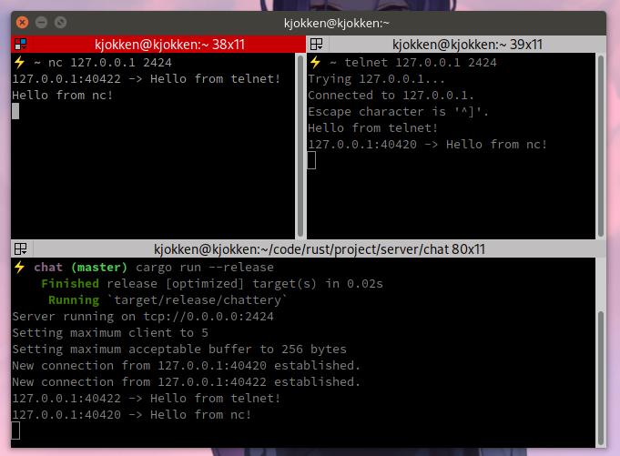

# Chattery
A simple multi-threaded chat application over TCP.

## Features
* Configurable
* Multi-threaded
* Absolutely low resource usage

## How to
**Client**  
Currently no official client, but it seamlessly running with `telnet` or `nc` like application.

## Credit
* Author: [KennFatt](https://github.com/KennFatt)